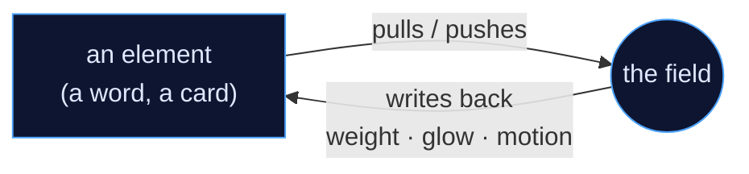

# field-ui, explained simply

Most of what's written about field-ui is precise and technical — contracts, passports, conformance.
This is the other thing: the friendly tour. No jargon, no prerequisites. If you've ever wondered what
this project actually *is* and why it might matter, start here.

## The one idea

You know how a **magnet** has an invisible push-and-pull around it, even though you can't see it?

A normal webpage is flat. The words and boxes sit still; they don't feel anything. **field-ui sprinkles
invisible magnets onto a page.** Now a word can say *"come here"* and the little floating bits of matter
drift toward it. A button can say *"keep back."* Some things spin matter in circles; some swallow it like
a tiny black hole.

And here's the part that makes it more than a screensaver — it goes **both ways**:

> Elements bend the field. The field bends them back.

The word pulls the matter… and when matter piles up on the word, the word *notices* and grows heavier,
bolder, and glowier. They play together, continuously, in one shared space:



That loop is the whole product.

## It was never really about the dots

The floating dots are just the *easiest thing to see*. The field doesn't care what you drop into it —
anything can play:

- **The real words and boxes.** The headline itself becomes a magnet; the paragraph beside it leans away
  to make room. The page doesn't get *decorated* by the field — it *lives inside* it.
- **The lines between things.** A footnote and its sentence are tied with an invisible rubber band.
  Related things pull together; things that disagree push apart.
- **You.** As you scroll, what you're reading lights up — and the page *remembers* where you've been, like
  footprints in sand.
- **Data.** Pour in a list of search results or claims, and each record becomes its own magnet: important
  ones sink into a deep well, shaky ones wobble, well-supported ones sit calm.

The dots show you the field is *there*. Everything else is what the field is *for*. The real idea is that
**meaning has weight** — being important, related, trusted, or already-read becomes something you can see
and feel, not just markup someone typed.

## How it's like real physics (and where it isn't)

field-ui isn't pretending. For several of its magnets it uses the **actual laws of the universe**:
gravity that pulls harder up close, electric charge where opposites attract, magnets that only bend
things that are *moving* (and only sideways), heat that makes matter jiggle, waves that ripple outward.
It even respects *"nothing from nothing"* — you can't conjure matter from thin air.

The universe has exactly four fundamental forces, and field-ui borrows all four as **ideas**:

| Real force | Becomes, in an interface |
|---|---|
| Gravity | **importance** — things converge on what matters |
| Electromagnetism | **agreement vs. disagreement** — signal, polarity, contrast |
| The strong force (glues atoms) | **belonging** — groups, clusters, bonds |
| The weak force (causes decay) | **fading** — expiration, handoff, release |

A body's pull even follows the softened inverse-square law, finite at the core and real $1/d^2$ far out:

$$
g = -\,\frac{G\,M\,\hat{r}}{d^2 + \varepsilon^2}, \qquad F = m\,g
$$

But — and this is important — it is **not** trying to be perfect physics. In the real world energy is
never lost; field-ui *lets it leak away on purpose*, like a gentle brake, so the page stays calm and
readable instead of bouncing forever. The trick that holds the whole thing together is **honesty about
which is which**:

- 🧪 *real physics* — `gravity`, `charge`, `magnetism`, heat, waves, bouncing, spreading
- 🎨 *tuned to feel nice* — the everyday `attract`, `repel`, `swirl`, `stream`, springs, bouncy walls
- 🌌 *pure pretend, built from real pieces* — `blackhole`, `galaxy`, `tornado`, `fountain`

The team is careful to never call the gentle, tuned `attract` "gravity," even though it'd be easy to. One
is the universe's rule; the other is a designer's choice wearing its costume.

## Recipes: the cookbook

You rarely build with raw magnets. You build with **recipes** — little cards, exactly like a recipe for
cookies, except it's *magnets + how it looks + what it means*:

> **Card: "Evidence Field"** *(for showing whether you can trust an answer)*
> Borrows from electricity + the glue-force · Magnets: `charge`, `link`, `repel`, `memory` · Wire each
> claim to its sources · Draw: dots, threads, a soft glow · If motion is off: a plain list with ✓ and ✗.

Every card keeps its boxes strictly separate — *idea words* describe, *magnet names* actually do the
work, *measurements* just count, *drawings* just show. You can be poetic in the idea box
("the claim crumbles to dust"), but the magnet box must name a **real** magnet. And a checker reads every
card before it's allowed in: real magnet names only, and you *must* say what happens with motion off.
So the cookbook can be creative, but it can never lie. There are already 64 of these cards.

## Can you mix them?

Yes — two ways, and the second is the secret heart of it.

1. **On one element**, you mash magnet lists together (a pull *and* a spin *and* a drain → a little black
   hole). Some mixes are delicious; some cancel out, like `attract` fighting `repel`.
2. **On one page**, you don't even have to try — because **there's only one pond.** Every recipe swims in
   the *same* invisible water, tugging the *same* matter. The pulls just add up, like two kids pulling one
   wagon. A page isn't a *list* of effects sitting side by side; it's a **soup**, where everything you add
   ripples through everything else.

(The one rule the pond enforces: don't put two drains next to each other, and if your recipe is a
*fountain*, it needs a budget — because *nothing from nothing*.)

## The deep end

Once the loop and the pond click, some genuinely advanced things fall out:

- **It can think ahead.** A mode quietly runs the simulation into the future — without touching the live
  screen — and draws a *ghost trail* of where matter is about to go.
- **Attention becomes a finite budget.** Declare one bucket of "importance" for the whole page; make one
  thing shine and the others *physically dim*. The page literally cannot scream about ten things at once.
- **Layout arranges itself.** Say what's connected; the boxes drift into their own comfortable spots and
  *re-settle* when the window changes.
- **The page learns behavior.** Footsteps leave fading trails, so the routes people actually take light up
  on their own — the same trick ants use to find the shortest path.
- **Data becomes feeling.** Add a row and a body drifts in; delete one and it *decays* instead of blinking
  out. For AI answers especially: supported claims sit calm, unsupported ones wobble, contradictions push
  apart — and (crucially) the system **never invents confidence it doesn't have.** It shows the evidence;
  it doesn't pretend to know the truth.
- **It explains itself.** Click anything and ask *why?* — *"I moved 60% because of this pull, I'm glowing
  because of these three neighbors."* Receipts, not a mystery box.
- **It can prove it's still fair with motion off** — that's a machine-checkable rule, not a hope.
- **The engine doesn't even need a webpage.** The brain that computes all this touches zero DOM — proven
  by a test — so the same physics could run on a game canvas, a native app, or headless on a server.

Marking something up to join all this is, at the simplest level, one attribute — and the same markup
works in plain HTML, React, Svelte, or Astro:

```ts
import { FieldField } from '@field-ui/react';

export function Headline() {
  // density returns to the element through --field-density; your CSS reads it back
  return (
    <FieldField density={1}>
      <h1 data-body="attract" data-strength={1.2} data-feedback>
        Mass
      </h1>
    </FieldField>
  );
}
```

## So why would you actually use it?

Honest answer first: **often you wouldn't.** For a landing page, a login, a checkout — normal CSS and
React are perfect, and field-ui would be overkill. The team will tell you that themselves.

What it does that *nothing else* does is treat interface state as **shared, relational, and physical**
instead of local and decorative. In every other tool — CSS transitions, animation libraries, particle
backgrounds, even graph-layout libraries — *"this is important," "these relate," "you already read this,"
"this answer is shaky"* are things you encode by hand, inconsistently, in a dozen places. In field-ui
they're forces in one shared medium, so they're consistent, they interact, and you can feel them. And
because the whole thing is **inspectable and honest** — it explains every move and labels what's real vs.
tuned vs. pretend — it's the rare kind of "magic" that hands you the receipts.

It earns its place when your content *already has* hidden relational meaning that flat UI throws away:
long documents, AI answers and evidence, dashboards, graphs, knowledge maps — anywhere *importance,
relationship, trust, or memory* is the actual point.

## The honest fine print

Because honesty is the project's whole ethos, the limits deserve daylight too:

- "Heavier things swing wider" is mostly *pretend* by default — real mass is opt-in.
- Energy isn't conserved (on purpose) — there's a hidden brake so the page stays calm.
- It costs something — lots of matter is real work for the browser; there are budgets and caps.
- **No human studies have been run yet.** The research papers *design* the experiments and make
  predictions; nobody has yet *measured* whether real people read, trust, or navigate better with it.
  That's a promise, not a result — and the papers say so plainly.

---

That's the tour: **a webpage you can play with, that plays back** — built on real physics where it helps,
gently faked where realism would just annoy, honest about the difference, and aimed at the one thing flat
interfaces keep throwing away: *meaning you can feel.*

If you want the rigorous version, the [research papers](/writings) pick up exactly here — one each for
reading, trust, accessibility, the runtime, recipes, data, and diagnostics.
