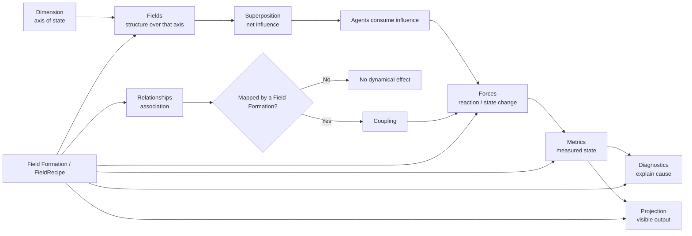
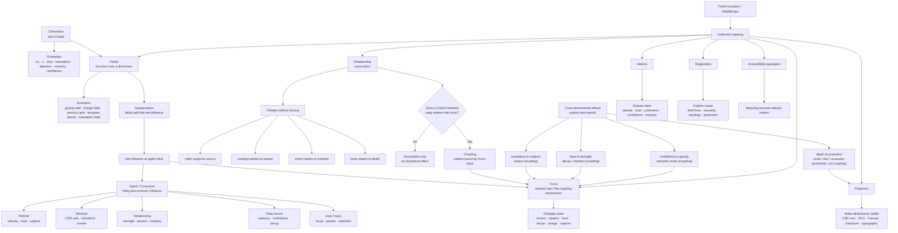
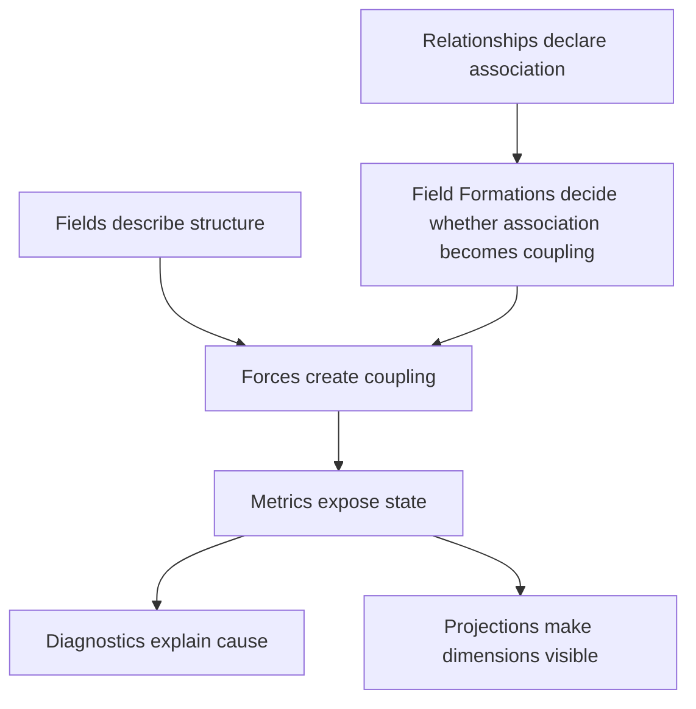

# Dimensional Coupling Doctrine

> **Status: canonical / doctrine.**
> How dimensions, fields, forces, relationships, metrics, diagnostics, and projections relate — and the
> guardrails that keep the system *authorable* rather than *magical*. This is the construction rule for
> re-expanding the [collapsed dimensions](designed-vs-natural-map.md) (depth, time, orientation). It sits
> beside [`natural-fields.md`](natural-fields.md) (the conceptual grammar),
> [`designed-vs-natural-map.md`](designed-vs-natural-map.md) (the truth relationship), the
> [behavior table](fundamental-field-behavior-table.md) (the executable contract), and
> [`feedback-channels.md`](feedback-channels.md) (the DOM output). Descriptive of intent; where it
> disagrees with the code, the code wins.

## At a glance



## Association is not coupling

The single most important distinction in the model:

```txt
Association says two things are related.
Coupling says one thing changes the other.
```

A **relationship** is a statement of association — it does **not** exert force just because it exists.
A **force** is a dynamical effect — it couples state and causes change. A relationship may *later* feed a
force, but only when a **Field Formation** says so, explicitly.

```txt
Citation A supports Claim B.        ← association alone. Moves nothing.

Evidence Field formation:            ← the Field Formation turns association into coupling.
  support relation     → cohesion
  contradiction relation → charge separation
  confidence metric    → gravity strength
```

This guardrail is what keeps the system **semantic and authorable rather than haunted.** Relationships
are non-causal by default.

## The dimensional model

A **dimension is an axis of state** — not a behavior, not a force. Each dimension may *host* fields,
metrics, diagnostics, and response laws, but coexisting in the same runtime does not make dimensions
affect one another.

Dimensions include: `x/y` position · `z`/depth · time · orientation/rotation (θ) · and the semantic
axes the field already carries — attention · memory · confidence.

**The default rules:**

```txt
Dimensions are orthogonal by default.
Fields superpose within a dimension.
Agents consume the net influence at their state.
Relationships associate state without causing dynamical effect.
Forces couple state and cause change.
Cross-dimensional coupling is opt-in and must be named.
```

Said as a progression: **default independence → declared coupling → observable association → composed
response.** Adding a dimension should not disturb existing behavior; it should only add *possible*
couplings.

### A dimension is not a force

Keep the layers distinct, or `time`, `memory`, `decay`, `prediction`, and `history` collapse into one
fuzzy bucket:

```txt
dimension   the axis of state
field       structure over that axis
force       response to that structure (and the only mechanism of coupling)
metric      measurement from that axis
diagnostic  visualization / explanation of that axis
projection  how that axis is made visible in the interface
```

### Within a dimension vs. across dimensions

```txt
Within a dimension, fields superpose.
Across dimensions, axes remain independent unless a coupling force connects them.
Agents respond to the net influence at their state.
Relationships can associate state without causing motion or mutation.
```

Note the sharpened claim: fields **do not usually affect fields** — they *accumulate into net influence*,
and matter/agents respond to that net. (Field-affecting-field is nonlinear physics; the engine's linear
superposition is what makes forces composable.)

## The concept table

| Concept | Meaning | Example |
|---|---|---|
| **Dimension** | Axis of state | `x/y`, `z`, time, θ, attention |
| **Field** | Structure over state | gravity well, charge field, memory grid |
| **Force** | Response law (the coupling mechanism) | `F = ma`, `qE`, torque |
| **Relationship** | Association without required motion | citation supports claim |
| **Coupling** | Declared cross-axis effect | torque links translation to rotation |
| **Metric** | Measured output | density, load, coherence |
| **Diagnostic** | Explanation layer | field lines, causality, topology |
| **Projection** | Makes a dimension visible | 3D → scale/blur/occlusion; time → trail/decay |

## The full picture



> One correction from the source sketch: `depth → projection` is a **projection** (visual), not a
> coupling (dynamical) — projection is deliberately *separate* from coupling, so it routes to Projection,
> not Force. The rest of the cross-dimensional arrows are genuine couplings and route through Force.

## Coupling requires a passport declaration

If a force couples dimensions, it declares so — the same way truth mode is declared — so the system stays
**inspectable**. A new passport field:

```txt
Couples dimensions:
  - none
  - x/y
  - x/y/z
  - translation → rotation
  - time → strength
  - memory → gravity
  - relation → charge
```

This is what makes the answer to *"why did this rotate?"* not "because the field did it" but:

```txt
This body rotated because torque coupled translational force into angular velocity.
```

## Dimensions need projections (separate from coupling)

The DOM is mostly 2D and present-tense, so every added dimension needs an explicit **projection rule** —
how its state renders back into the interface. **Projection is separate from coupling:** you can
*visualize* a dimension without letting it *affect* another.

```txt
3D          → screen position, scale, blur, occlusion, layering
time        → trail, heat, decay, ghost, replay, sediment
orientation → transform, glyph axis, flow direction, alignment, torque indicator
confidence  → opacity, density, stability, topology, annotation
```

## Construction rule for the collapsed dimensions

The next frontier is **not another token — it is restoring dimensions of state the interface engine
collapsed.** Each is built the same way: add the axis, keep it independent by default, name the coupling.

- **Orientation.** Add θ and angular velocity as their own lane. Keep them independent by default.
  Introduce **torque** (`τ = r × F`) as the *explicit* coupling between translation and rotation.
- **Time.** Add temporal coordinates and temporal fields. Do **not** let time "push back" by default
  (it is the independent evolution parameter — no closed timelike loops). Use decay, memory, prediction,
  replay, and scheduling as explicit **temporal kernels**.
- **Depth.** Promote `z` from an optional lane to first-class state. Keep `x/y` behavior unchanged unless
  a 3D field, perspective projection, occlusion, or depth-aware force is enabled.

## Body-authority modes

A body's *position authority* is itself a small truth-mode set — not one irreversible architecture
choice. Three modes, each already partly present:

| Mode | Authority | Status |
|---|---|---|
| **Anchored Body** | The DOM rect is authoritative; the body is a stable source / boundary / infinite-mass reference. | **Shipped** — the default (`element.getBoundingClientRect()` each frame; `definition-document.md`). |
| **Kinematic Body** | The engine writes a transform; the DOM object moves *visually*, but motion is mediated through the platform layer. | **Shipped** — `data-move` (element impulse → `translate`; `agent-consumption-model.md`). |
| **Dynamic Body** | The engine owns position, velocity, and possibly mass; DOM measurement *initializes or constrains*, but does not fully define body state. | **Future** — required for fully physical recoil. |

The current system is therefore not *wrong* — it is **Anchored interface mode.** Recoil requires Dynamic
mode (or Kinematic-with-readback), which is why the body-authority decision gates recoil (see the
[substrate frontier](../planning/substrate-architecture-frontier.md)).

## On Field Formation (without renaming the API)

After this physics framing, "recipe" can read as casual — but `FieldRecipe`, `compileRecipe`, and
`applyRecipe` are part of the **frozen public API** ([`api-stability.md`](api-stability.md)). Do **not**
rename them. The canonical concept is a **Field Formation**; the API representation stays `FieldRecipe`.
Use lane separation instead:

```txt
Pattern          the human-facing reusable behavior name
Field Formation  the canonical field-native authored arrangement
FieldRecipe      the current API representation of a Field Formation
Field Contract   the compiled executable plan
Configuration    ordinary settings/options only
Matter           participants/substance only
```

> A `FieldRecipe` is the API representation of a Field Formation: a declared arrangement of semantic
> intent, dimensions, bodies, fields, forces, relationships, metrics, diagnostics, projections, and
> accessibility equivalents.

A Field Formation is more than a bundle of tokens. It is the authored arrangement that decides which
associations become couplings, which dimensions participate, which forces act, which metrics are exposed,
which diagnostics explain cause, and which projections preserve meaning. This terminology change does not
rename any API symbol, route, catalog identifier, validator, or check. (The terminology decision —
"Field Formation" canonical, no API rename before a major-version migration — is tracked as a **board
decision**.)

## Reading any force (the five-question method)

To understand any force, ask:

```txt
1. Which Natural Field, if any, does it translate?      (natural-fields.md)
2. What truth mode does it claim?                        (behavior table)
3. Is it faithful, an idealization, a departure, or no-analog?   (designed-vs-natural map)
4. What does field() expose?                             (invisible structure)
5. What does apply() change — and does it couple dimensions?     (the cause + the coupling passport)
```

`field()` returns invisible structure; `apply()` causes change. That distinction is load-bearing —
keep it visible.

## The core doctrine

```txt
Fields describe structure.
Forces create coupling.
Relationships declare association.
Metrics expose state.
Diagnostics explain cause.
Projections make dimensions visible.
Field Formations decide which associations become couplings.
```


